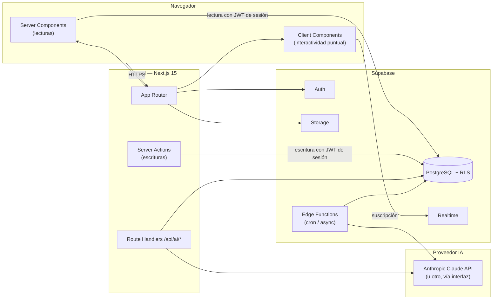
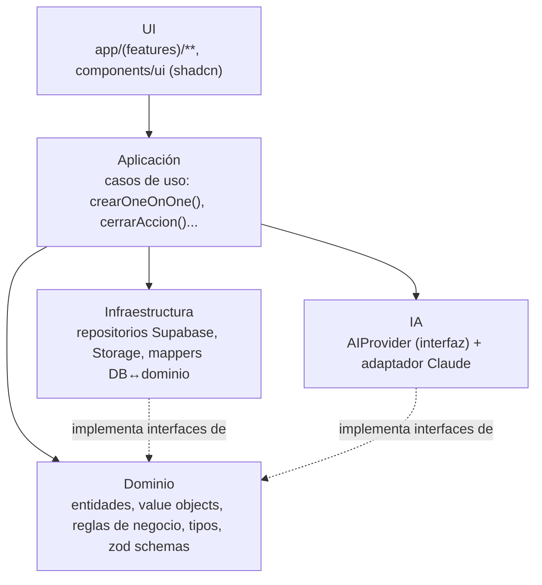
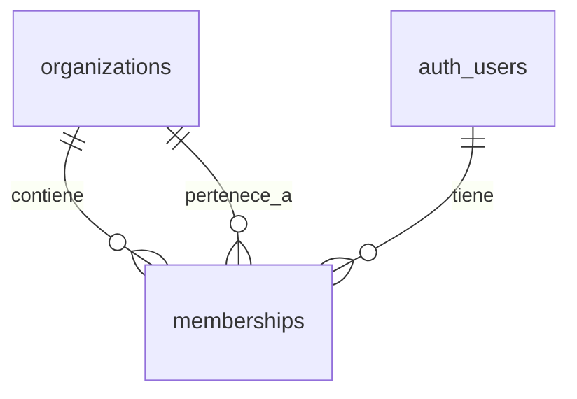

# 2. Arquitectura

## 2.1 Vista de alto nivel

**Decisión clave**: un único repositorio Next.js desplegado en Vercel, sin backend separado. Supabase hace de "backend as a service" pero **PostgreSQL con RLS es la autoridad de seguridad**, no la capa de aplicación. Esto significa que aunque un Server Action tenga un bug, la base de datos igualmente rechaza consultas fuera del alcance del usuario autenticado.

## 2.2 Principios arquitectónicos

1. **La regla de dependencia va hacia adentro**: UI → Aplicación → Dominio. Dominio no importa nada de Next.js, Supabase ni React. Infraestructura implementa interfaces que el dominio define, nunca al revés.
2. **RLS es la fuente de verdad de seguridad**, no un cinturón extra. Cualquier consulta, venga de un Server Component, un Server Action o una futura app móvil, pasa por las mismas políticas.
3. **Server Components por defecto.** Un componente es Client solo si necesita estado interactivo, suscripción realtime o una librería que lo exige (drag & drop, gráficos).
4. **Server Actions para toda escritura del propio dominio.** No se crea una API REST/GraphQL propia para CRUD interno — sería duplicar lo que Server Actions ya resuelven con menos capas.
5. **React Query solo donde aporta valor real** (ver 2.5). Por defecto, revalidation de Next.js tras un Server Action basta.
6. **La IA es un módulo, no un conjunto de llamadas sueltas.** Vive detrás de una interfaz (`AIProvider`) y de Route Handlers/Edge Functions propios; el resto de la app no sabe qué proveedor hay detrás.
7. **Nada de datos sensibles sobrescritos.** Salario y auditoría son *append-only* a nivel de base de datos (permisos revocados de `UPDATE`/`DELETE`), no solo por convención de la UI.

## 2.3 Capas

- **UI**: páginas (Server Components), componentes de presentación, formularios (Client Components mínimos con `react-hook-form` + `zod`). No contiene lógica de negocio — solo la invoca.
- **Dominio**: tipos y validaciones (`zod`) que representan Persona, OneOnOne, Acción, Objetivo, RevisiónSalarial. Incluye reglas puras (p. ej. "una acción vencida es `due_date < hoy` y `status` no terminal") sin tocar la base de datos.
- **Aplicación**: casos de uso que orquestan dominio + infraestructura (`crearOneOnOne`, `cerrarAccion`, `registrarRevisionSalarial`, `generarResumenIA`). Aquí viven los Server Actions como fina capa de entrada.
- **Infraestructura**: implementaciones concretas — repositorios que hablan con Supabase (cliente server-side con el JWT del usuario, nunca `service_role` desde código de request de usuario), adaptador de Storage, mappers de filas de PostgreSQL a tipos de dominio.
- **IA**: interfaz `AIProvider` con métodos como `summarizeOneOnOne()`, `suggestNextActions()`, `detectRisk()`; el adaptador por defecto llama a la API de Anthropic. Cambiar de proveedor es sustituir el adaptador, no tocar el resto del sistema.

## 2.4 Next.js 15: qué va en cada sitio

| Necesidad | Mecanismo | Ejemplo |
|---|---|---|
| Mostrar datos | Server Component + fetch directo al repositorio | Ficha de persona, dashboard, listado |
| Guardar/mutar datos | Server Action | Crear acción, cerrar 1:1, registrar revisión salarial |
| Interactividad de formulario (validación en vivo) | Client Component + `react-hook-form` + `zod` (mismo schema que el dominio) | Formulario de alta de persona |
| Tablero con arrastrar y soltar | Client Component + estado local optimista | Kanban de acciones |
| Contador que debe sentirse "vivo" | Client Component + Supabase Realtime | Acciones vencidas en el dashboard |
| Llamada a IA desde la UI | Server Action → Route Handler interno → `AIProvider` | Botón "Generar resumen" en el cierre del 1:1 |
| Tarea programada (recordatorios, digest) | Supabase Edge Function + `pg_cron` | Aviso de 1:1 de mañana |

## 2.5 Cuándo sí usar React Query (y cuándo no)

**Sí**, porque aporta valor real:
- **Kanban de acciones**: arrastrar una tarjeta debe sentirse instantáneo (optimistic update) y poder revertirse si el Server Action falla.
- **Notificaciones/contadores en vivo**: se combinan con Supabase Realtime; React Query gestiona la caché local que Realtime va invalidando.
- **Autocompletar/búsqueda de personas** en selects usados en varios formularios (evita refetch redundante entre componentes hermanos).

**No**, porque Server Components + revalidation ya resuelven el caso sin coste añadido:
- Listados y fichas que se leen y ocasionalmente se escriben (Personas, Objetivos, Revisiones salariales, Informes). Un Server Action que llama a `revalidatePath` tras escribir es suficiente y más simple de razonar.

## 2.6 Supabase: estrategia por servicio

- **Auth**: email/password + magic link en v1. Google OAuth queda listo para activar si la respuesta a la pregunta abierta de SSO es afirmativa (ver `00-resumen-ejecutivo.md`). Los roles **no** se guardan en `app_metadata` del JWT (requeriría refrescar el token al cambiar de rol); se resuelven en cada consulta contra la tabla `memberships`, que es lo que las políticas RLS consultan.
- **RLS**: activada en todas las tablas de dominio desde la primera migración. Patrón general: el usuario debe tener una fila en `memberships` para la `organization_id` de la fila que intenta leer/escribir, y el rol de esa membership determina el alcance (Admin: toda la organización; Manager: su equipo, resuelto por `people.manager_id`; Empleado futuro: solo sus propias filas). Detalle completo en `03-modelo-datos.md`.
- **Storage**: un bucket `documents` con carpetas por `organization_id/person_id`; políticas de Storage replican la misma lógica de acceso que RLS en PostgreSQL.
- **Realtime**: activado sobre `actions` y `notifications` para los contadores en vivo del dashboard; no se usa en tablas de bajo cambio (p. ej. `salary_records`).
- **Edge Functions**: para trabajo asíncrono/programado que no debe bloquear una petición HTTP del usuario — recordatorios diarios, generación de informes pesados, llamadas a IA que se disparan por evento (p. ej. resumen automático nocturno) en vez de por click. Las llamadas a IA disparadas directamente por el usuario (botón "generar resumen ahora") van por Route Handler para mantener la latencia baja y el código en el mismo repo.

## 2.7 Multi-tenancy y roles

- `organizations`: una fila por empresa/equipo. En v1 hay exactamente una fila.
- `memberships`: relaciona `auth.users` con `organizations` y fija el `role` (`admin`/`manager`/`employee`). Un usuario puede tener membership en varias organizaciones en el futuro (p. ej. si un manager colabora con dos equipos), aunque v1 no lo explota.
- Todas las tablas de dominio (Personas, 1:1, Acciones, Objetivos, Revisiones, Documentos, Informes) tienen `organization_id`. Escalar de "solo tú" a "toda la empresa" es **añadir filas a `memberships` y `organizations`**, no una migración de esquema.

## 2.8 Seguridad y auditoría

- Principio de menor privilegio: el cliente de Supabase usado en Server Components/Actions siempre lleva el JWT del usuario; la `service_role` key solo se usa en Edge Functions/cron, nunca expuesta a código que responde a una petición de usuario.
- `audit_log` genérico (entidad, acción, diff, autor, fecha) alimentado por triggers de PostgreSQL en las tablas sensibles (`people`, `salary_records`, `memberships`) — así la auditoría no depende de que el código de aplicación recuerde escribirla.
- Notas privadas (`people_private_notes`) con RLS más estricta que el resto: visibles solo para el autor y para Admin, nunca para el propio empleado aunque en el futuro tenga acceso de autoservicio.

## 2.9 Calidad y despliegue

- **Testing**: unitario sobre dominio (reglas puras, sin mocks de red), integración sobre repositorios de infraestructura contra una base Supabase local (`supabase start`), end-to-end (Playwright) sobre los flujos críticos: alta de persona, ciclo completo de un 1:1, cierre de una acción.
- **CI/CD**: GitHub Actions ejecuta lint + typecheck + tests en cada PR; Vercel genera preview deployment automático por PR; merge a `main` despliega a producción.
- **Migraciones**: gestionadas con Supabase CLI (`supabase/migrations`), versionadas en el mismo repo — el esquema de `03-modelo-datos.md` es el origen de la primera migración.
