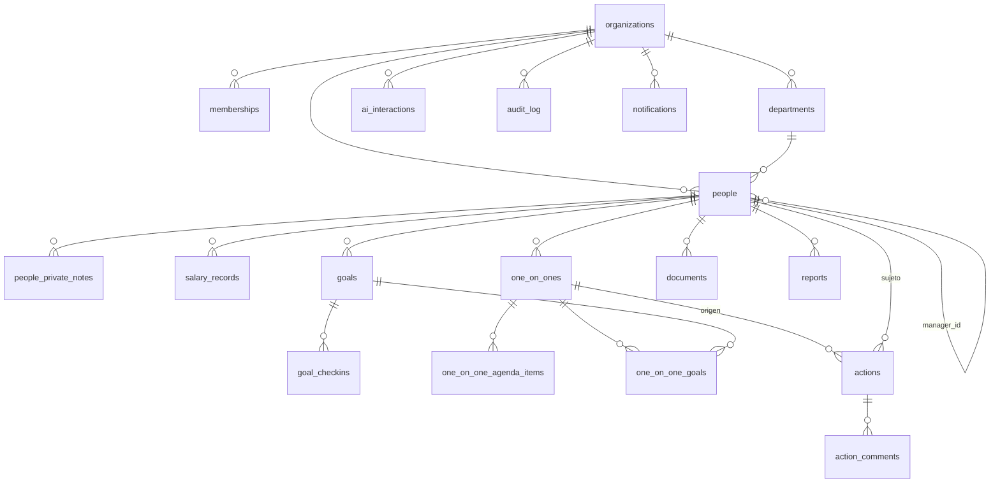

# 3. Modelo de datos

Esquema completo en PostgreSQL (Supabase). Convenciones: `uuid` como PK (`gen_random_uuid()`), `timestamptz` para toda fecha-hora, `created_at`/`updated_at` en toda tabla mutable, `organization_id` en toda tabla de dominio, borrado lógico donde el negocio lo pide (personas) y **prohibición real de `UPDATE`/`DELETE`** donde el negocio exige histórico (salarios, auditoría).

## 3.1 Diagrama entidad-relación



## 3.2 Tipos enumerados

```sql
create type membership_role as enum ('admin', 'manager', 'employee');
create type employment_status as enum ('active', 'on_leave', 'offboarded');
create type contract_type as enum ('indefinido', 'temporal', 'practicas', 'freelance', 'obra_y_servicio');
create type one_on_one_status as enum ('scheduled', 'completed', 'cancelled', 'no_show');
create type meeting_mode as enum ('in_person', 'video', 'phone');
create type action_status as enum ('pending', 'in_progress', 'blocked', 'completed', 'cancelled');
create type action_priority as enum ('low', 'medium', 'high', 'urgent');
create type goal_status as enum ('on_track', 'at_risk', 'off_track', 'completed', 'cancelled');
create type salary_change_reason as enum ('hire', 'review', 'promotion', 'market_adjustment', 'correction');
create type document_category as enum ('contract', 'id_document', 'review', 'certificate', 'other');
create type report_type as enum ('one_on_one_pdf', 'employee_summary', 'employee_annual', 'employee_full');
create type audit_action as enum ('create', 'update', 'delete');
create type note_visibility as enum ('manager_only', 'admin_only');
```

## 3.3 Tablas núcleo (organización y personas)

```sql
create table organizations (
    id uuid primary key default gen_random_uuid(),
    name text not null,
    slug text not null unique,
    created_at timestamptz not null default now()
);

create table memberships (
    id uuid primary key default gen_random_uuid(),
    organization_id uuid not null references organizations(id) on delete cascade,
    user_id uuid not null references auth.users(id) on delete cascade,
    role membership_role not null,
    created_at timestamptz not null default now(),
    unique (organization_id, user_id)
);
create index idx_memberships_user on memberships(user_id);
create index idx_memberships_org on memberships(organization_id);

create table departments (
    id uuid primary key default gen_random_uuid(),
    organization_id uuid not null references organizations(id) on delete cascade,
    name text not null,
    parent_department_id uuid references departments(id) on delete set null,
    created_at timestamptz not null default now(),
    unique (organization_id, name)
);
create index idx_departments_org on departments(organization_id);

create table people (
    id uuid primary key default gen_random_uuid(),
    organization_id uuid not null references organizations(id) on delete cascade,
    user_id uuid references auth.users(id) on delete set null, -- solo si la persona también tiene acceso a la app
    first_name text not null,
    last_name text not null,
    email text not null,
    phone text,
    avatar_url text,
    position_title text not null,
    department_id uuid references departments(id) on delete set null,
    manager_id uuid references people(id) on delete set null,
    hire_date date not null,
    termination_date date,
    employment_status employment_status not null default 'active',
    contract_type contract_type not null,
    created_at timestamptz not null default now(),
    updated_at timestamptz not null default now(),
    constraint chk_termination_after_hire check (termination_date is null or termination_date >= hire_date),
    constraint chk_not_own_manager check (manager_id is null or manager_id <> id)
);
create index idx_people_org on people(organization_id);
create index idx_people_manager on people(organization_id, manager_id);
create index idx_people_department on people(organization_id, department_id);
create index idx_people_status on people(organization_id, employment_status);
create unique index idx_people_org_email on people(organization_id, email);

create table people_private_notes (
    id uuid primary key default gen_random_uuid(),
    organization_id uuid not null references organizations(id) on delete cascade,
    person_id uuid not null references people(id) on delete cascade,
    author_id uuid not null references auth.users(id),
    note text not null,
    visibility note_visibility not null default 'manager_only',
    created_at timestamptz not null default now()
);
create index idx_private_notes_person on people_private_notes(person_id);
```

## 3.4 Revisiones salariales (append-only)

```sql
create table salary_records (
    id uuid primary key default gen_random_uuid(),
    organization_id uuid not null references organizations(id) on delete cascade,
    person_id uuid not null references people(id) on delete cascade,
    effective_date date not null,
    gross_annual_salary numeric(12,2) not null check (gross_annual_salary >= 0),
    currency char(3) not null default 'EUR',
    variable_comp numeric(12,2) default 0,
    reason salary_change_reason not null,
    notes text,
    created_by uuid not null references auth.users(id),
    created_at timestamptz not null default now()
);
create index idx_salary_person_date on salary_records(person_id, effective_date desc);

-- Append-only real: se revocan los permisos de update/delete a nivel de rol de aplicación.
revoke update, delete on salary_records from authenticated;
```

El "salario actual" nunca es una columna; es siempre `select * from salary_records where person_id = $1 order by effective_date desc limit 1`. Una corrección se registra como fila nueva con `reason = 'correction'`.

## 3.5 Objetivos

```sql
create table goals (
    id uuid primary key default gen_random_uuid(),
    organization_id uuid not null references organizations(id) on delete cascade,
    person_id uuid not null references people(id) on delete cascade,
    title text not null,
    description text,
    category text,
    year int not null,
    start_date date not null,
    end_date date not null,
    status goal_status not null default 'on_track',
    weight numeric(4,2) default 1.0,
    created_by uuid not null references auth.users(id),
    created_at timestamptz not null default now(),
    updated_at timestamptz not null default now(),
    constraint chk_goal_dates check (end_date >= start_date)
);
create index idx_goals_person_year on goals(person_id, year);
create index idx_goals_org_status on goals(organization_id, status);

create table goal_checkins (
    id uuid primary key default gen_random_uuid(),
    goal_id uuid not null references goals(id) on delete cascade,
    checkin_date date not null default current_date,
    progress_percent numeric(5,2) not null check (progress_percent between 0 and 100),
    comment text,
    created_by uuid not null references auth.users(id),
    created_at timestamptz not null default now()
);
create index idx_goal_checkins_goal on goal_checkins(goal_id, checkin_date desc);
```

El "% de cumplimiento actual" de un objetivo es el `progress_percent` del checkin más reciente, no un campo en `goals`.

## 3.6 One2One

```sql
create table one_on_ones (
    id uuid primary key default gen_random_uuid(),
    organization_id uuid not null references organizations(id) on delete cascade,
    person_id uuid not null references people(id) on delete cascade,
    manager_id uuid not null references people(id) on delete cascade,
    scheduled_at timestamptz not null,
    actual_started_at timestamptz,
    actual_ended_at timestamptz,
    status one_on_one_status not null default 'scheduled',
    mode meeting_mode not null default 'video',
    manager_comments text,
    employee_comments text,
    overall_rating smallint check (overall_rating between 1 and 5),
    ai_summary text,
    next_meeting_suggested_at timestamptz,
    created_by uuid not null references auth.users(id),
    created_at timestamptz not null default now(),
    updated_at timestamptz not null default now()
);
create index idx_one_on_ones_person on one_on_ones(person_id, scheduled_at desc);
create index idx_one_on_ones_org_status on one_on_ones(organization_id, status, scheduled_at);

create table one_on_one_agenda_items (
    id uuid primary key default gen_random_uuid(),
    one_on_one_id uuid not null references one_on_ones(id) on delete cascade,
    topic text not null,
    source text not null default 'manual', -- manual | goal | action | ai_suggested
    position int not null default 0,
    discussed boolean not null default false,
    notes text
);
create index idx_agenda_items_meeting on one_on_one_agenda_items(one_on_one_id, position);

create table one_on_one_goals (
    one_on_one_id uuid not null references one_on_ones(id) on delete cascade,
    goal_id uuid not null references goals(id) on delete cascade,
    notes text,
    primary key (one_on_one_id, goal_id)
);
```

## 3.7 Acciones

```sql
create table actions (
    id uuid primary key default gen_random_uuid(),
    organization_id uuid not null references organizations(id) on delete cascade,
    person_id uuid not null references people(id) on delete cascade,       -- a quien afecta
    assignee_id uuid not null references people(id) on delete cascade,     -- quien debe ejecutarla
    one_on_one_id uuid references one_on_ones(id) on delete set null,      -- origen, si aplica
    title text not null,
    description text,
    status action_status not null default 'pending',
    priority action_priority not null default 'medium',
    due_date date,
    blocked_reason text,
    completed_at timestamptz,
    created_by uuid not null references auth.users(id),
    created_at timestamptz not null default now(),
    updated_at timestamptz not null default now(),
    constraint chk_blocked_reason check (status <> 'blocked' or blocked_reason is not null)
);
create index idx_actions_org_status_due on actions(organization_id, status, due_date);
create index idx_actions_assignee on actions(assignee_id, status);
create index idx_actions_person on actions(person_id);
create index idx_actions_one_on_one on actions(one_on_one_id);

create table action_comments (
    id uuid primary key default gen_random_uuid(),
    action_id uuid not null references actions(id) on delete cascade,
    author_id uuid not null references auth.users(id),
    comment text not null,
    created_at timestamptz not null default now()
);
create index idx_action_comments_action on action_comments(action_id, created_at);
```

Una acción "vencida" es una regla de dominio (`due_date < current_date and status not in ('completed','cancelled')`), calculada en consulta, no un estado que haya que actualizar por cron.

## 3.8 Documentos e informes

```sql
create table documents (
    id uuid primary key default gen_random_uuid(),
    organization_id uuid not null references organizations(id) on delete cascade,
    person_id uuid not null references people(id) on delete cascade,
    uploaded_by uuid not null references auth.users(id),
    storage_path text not null,
    file_name text not null,
    mime_type text not null,
    size_bytes bigint not null,
    category document_category not null default 'other',
    created_at timestamptz not null default now()
);
create index idx_documents_person on documents(person_id);

create table reports (
    id uuid primary key default gen_random_uuid(),
    organization_id uuid not null references organizations(id) on delete cascade,
    person_id uuid references people(id) on delete cascade,
    one_on_one_id uuid references one_on_ones(id) on delete cascade,
    type report_type not null,
    generated_by uuid not null references auth.users(id),
    storage_path text not null,
    params jsonb not null default '{}',
    generated_at timestamptz not null default now()
);
create index idx_reports_person on reports(person_id);
```

## 3.9 IA, auditoría y notificaciones

```sql
create table ai_interactions (
    id uuid primary key default gen_random_uuid(),
    organization_id uuid not null references organizations(id) on delete cascade,
    related_entity_type text not null, -- 'one_on_one' | 'person' | 'goal' ...
    related_entity_id uuid not null,
    kind text not null,                -- 'summary' | 'risk_detection' | 'suggested_actions' | 'meeting_prep' ...
    prompt text not null,
    response text not null,
    model text not null,
    tokens_used int,
    created_by uuid not null references auth.users(id),
    created_at timestamptz not null default now()
);
create index idx_ai_interactions_entity on ai_interactions(related_entity_type, related_entity_id);
create index idx_ai_interactions_org on ai_interactions(organization_id, created_at desc);

create table audit_log (
    id uuid primary key default gen_random_uuid(),
    organization_id uuid not null references organizations(id) on delete cascade,
    actor_id uuid references auth.users(id),
    entity_type text not null,
    entity_id uuid not null,
    action audit_action not null,
    diff jsonb not null default '{}',
    created_at timestamptz not null default now()
);
create index idx_audit_entity on audit_log(entity_type, entity_id);
create index idx_audit_org_date on audit_log(organization_id, created_at desc);
revoke update, delete on audit_log from authenticated;

create table notifications (
    id uuid primary key default gen_random_uuid(),
    organization_id uuid not null references organizations(id) on delete cascade,
    user_id uuid not null references auth.users(id) on delete cascade,
    type text not null, -- 'upcoming_one_on_one' | 'overdue_action' | 'goal_checkin_due' ...
    payload jsonb not null default '{}',
    read_at timestamptz,
    created_at timestamptz not null default now()
);
create index idx_notifications_user_unread on notifications(user_id, read_at);
```

## 3.10 Row Level Security — patrón general

Toda tabla de dominio activa RLS. El patrón se apoya en una función auxiliar que resuelve la membership del usuario actual:

```sql
create or replace function current_membership(p_org uuid)
returns membership_role
language sql stable security definer as $$
    select role from memberships
    where organization_id = p_org and user_id = auth.uid()
$$;

create or replace function is_manager_of(p_person_id uuid)
returns boolean
language sql stable security definer as $$
    select exists (
        select 1 from people mgr
        join people emp on emp.manager_id = mgr.id
        where emp.id = p_person_id and mgr.user_id = auth.uid()
    )
$$;
```

Ejemplo de políticas sobre `people` (el resto de tablas siguen el mismo patrón: Admin ve todo en su organización, Manager ve/edita su propio equipo, Empleado futuro solo su propia fila):

```sql
alter table people enable row level security;

create policy people_select on people for select
using (
    current_membership(organization_id) = 'admin'
    or manager_id in (select id from people where user_id = auth.uid())
    or user_id = auth.uid()
);

create policy people_insert on people for insert
with check (current_membership(organization_id) in ('admin','manager'));

create policy people_update on people for update
using (
    current_membership(organization_id) = 'admin'
    or manager_id in (select id from people where user_id = auth.uid())
)
with check (
    current_membership(organization_id) = 'admin'
    or manager_id in (select id from people where user_id = auth.uid())
);

-- Sin policy de delete: las bajas son un update de employment_status, no un delete.
```

Notas por tabla que se desvían del patrón general:

- **`people_private_notes`**: `select`/`insert` restringidos a `author_id = auth.uid() or current_membership(organization_id) = 'admin'` — ni siquiera otro manager del equipo ve la nota privada de otro.
- **`salary_records`**: `select` igual que `people` (admin o manager de esa persona); `insert` solo `admin`/`manager`; sin `update`/`delete` a nivel de permisos de rol (ver 3.4).
- **`ai_interactions`** y **`audit_log`**: `select` para admin/manager de la organización; **sin policy de `insert` para `authenticated`** — se escriben únicamente vía funciones `security definer` invocadas por Server Actions/Edge Functions, nunca directamente desde el cliente.
- **`documents`**: además de RLS en PostgreSQL, el bucket de Storage replica la misma condición (carpeta `organization_id/person_id`) mediante políticas de Storage.

## 3.11 Triggers de auditoría

```sql
create or replace function log_audit_event()
returns trigger
language plpgsql security definer as $$
begin
    insert into audit_log (organization_id, actor_id, entity_type, entity_id, action, diff)
    values (
        coalesce(new.organization_id, old.organization_id),
        auth.uid(),
        TG_TABLE_NAME,
        coalesce(new.id, old.id),
        lower(TG_OP)::audit_action,
        case TG_OP
            when 'DELETE' then to_jsonb(old)
            else jsonb_build_object('before', to_jsonb(old), 'after', to_jsonb(new))
        end
    );
    return coalesce(new, old);
end;
$$;

create trigger trg_audit_people
after insert or update or delete on people
for each row execute function log_audit_event();

create trigger trg_audit_salary_records
after insert on salary_records -- solo insert: no hay update/delete posibles
for each row execute function log_audit_event();

create trigger trg_audit_memberships
after insert or update or delete on memberships
for each row execute function log_audit_event();
```

## 3.12 Buenas prácticas aplicadas

- **Sin borrado físico de personas**: `employment_status` + `termination_date`. El histórico de informes anuales sigue siendo válido tras una baja.
- **Sin sobrescritura donde importa la trazabilidad**: `salary_records` y `goal_checkins` son series temporales, no campos mutables.
- **Índices alineados con las consultas del dashboard**: `(organization_id, status, due_date)` en `actions`, `(organization_id, status, scheduled_at)` en `one_on_ones` — exactamente lo que el dashboard filtra.
- **Restricciones a nivel de base de datos, no solo de UI**: `chk_blocked_reason`, `chk_termination_after_hire`, `chk_not_own_manager` evitan estados inconsistentes aunque un futuro cliente (móvil, script) escriba directo contra Supabase.
- **`security definer` acotado**: las funciones que necesitan saltarse RLS (auditoría, resolución de membership) son las mínimas imprescindibles y no exponen escritura arbitraria.
