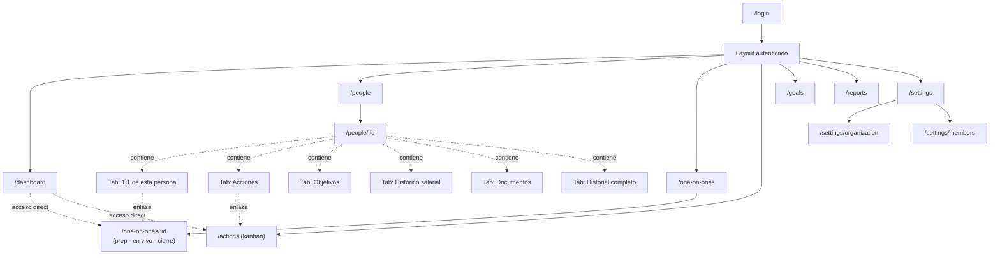
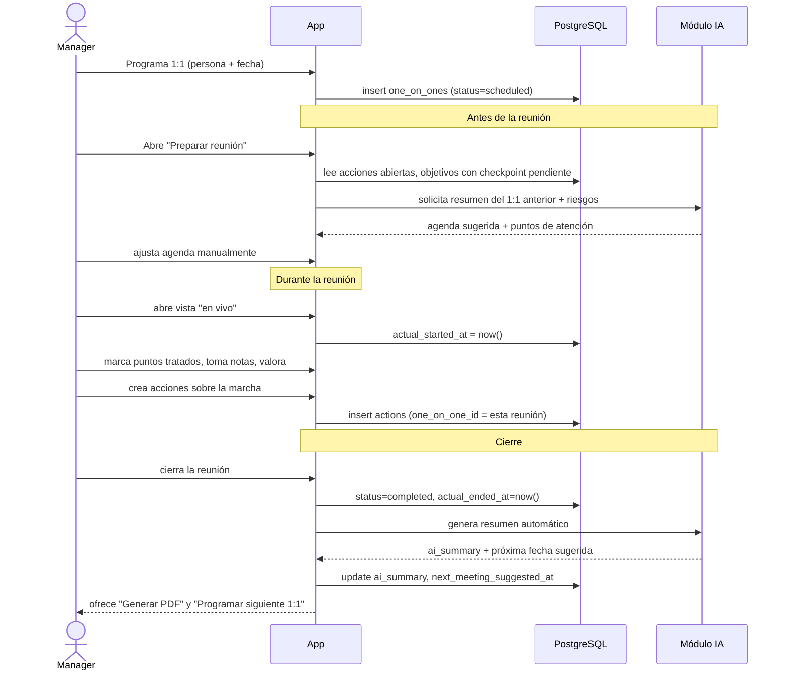
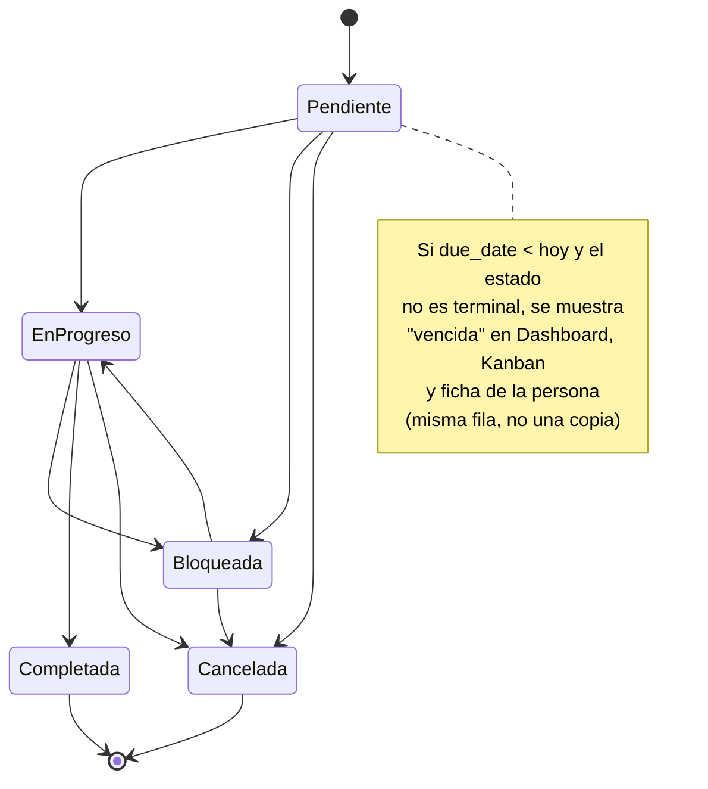
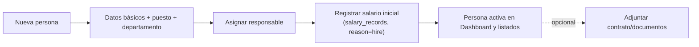
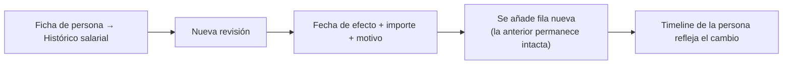

# 5. Flujo de navegación

## 5.1 Sitemap

Navegación primaria: sidebar fija (estilo Linear) con Dashboard, Personas, 1:1, Acciones, Objetivos, Informes, Ajustes. Paleta de comandos (`Cmd+K`, estilo Raycast) para saltar a cualquier persona, 1:1 o acción sin pasar por el sidebar — importante porque en un equipo de tamaño mediano navegar por menús es más lento que buscar.

## 5.2 Flujo crítico: ciclo de vida de un 1:1

Este es el flujo que reemplaza por completo la plantilla Word.

Puntos de diseño relevantes:
- La agenda sugerida se calcula, no se copia de la reunión anterior — así nunca queda desactualizada.
- Crear una acción durante la reunión no es un paso aparte: es un atajo dentro de la misma vista, con `one_on_one_id` ya rellenado.
- El resumen de IA es una propuesta editable, no un texto final — el manager siempre puede corregirlo antes de que quede en el histórico.

## 5.3 Flujo: acción vencida hasta resolución

## 5.4 Flujo: alta de persona

No existe un "campo salario" que rellenar y ya está: el alta siempre crea la primera fila del histórico salarial, reforzando desde el primer uso que el salario es una serie temporal.

## 5.5 Flujo: revisión salarial

No hay botón "editar" sobre una fila existente del histórico — solo "añadir revisión", incluso para corregir un error (motivo `corrección`).
