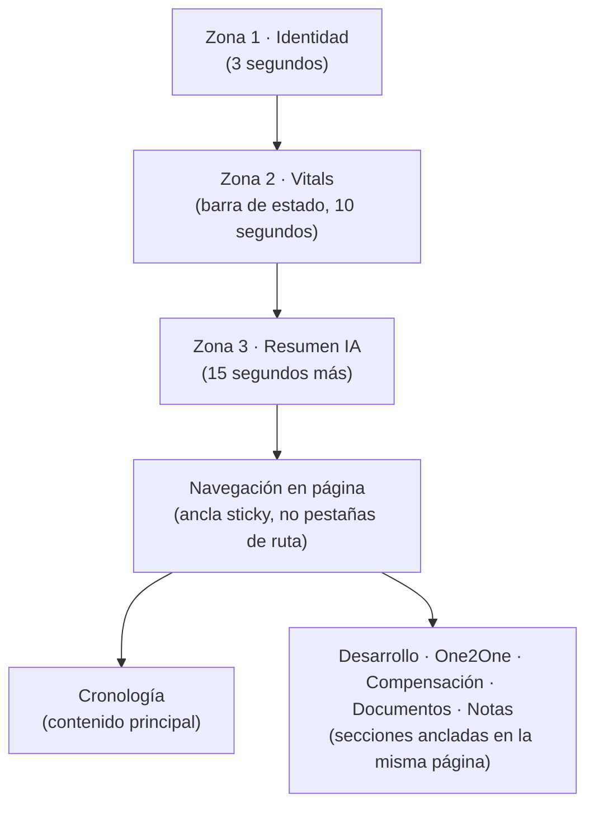

# 3. Ficha de empleado — el corazón del producto

## 3.1 El problema a resolver

No es "dónde meto estos 15 campos". Es: *una persona abre la ficha de un empleado y en 30 segundos entiende su situación completa* — sin pestañas que explorar, sin recordar dónde estaba cada dato. Todo lo demás de este documento se deriva de esa restricción.

Solución: **una sola página, dividida en zonas por velocidad de lectura**, no un conjunto de pestañas. De arriba a abajo: lo que se lee en 3 segundos, lo que se lee en 30 segundos, lo que se explora si hace falta.

## 3.2 Anatomía de la página

**Por qué una sola página y no pestañas de ruta**: cambiar de pestaña de ruta (`/people/:id/goals`, `/people/:id/salary`...) cuesta una navegación completa y pierde la posición de scroll. Anclas dentro de la misma página cuestan un scroll instantáneo y el contexto (identidad, vitals) permanece visible arriba. Es la diferencia entre cómo Notion organiza una página larga y cómo un ERP organiza pestañas — elegimos Notion.

### Zona 1 — Identidad (siempre visible, cabecera)

Avatar, nombre, puesto, departamento, responsable, estado (pill), tipo de contrato. Fila única, sin decoración. Es lo que hoy tarda 3 segundos en identificar "de quién estamos hablando y en qué situación laboral está".

### Zona 2 — Vitals (barra de estado)

Seis chips horizontales, la respuesta a las seis preguntas que te haces sin pensar antes de un 1:1 o antes de decidir algo sobre esa persona:

| Chip | Contenido | Color si requiere atención |
|---|---|---|
| Antigüedad | "2 años 4 meses" | — (informativo) |
| Próximo 1:1 | fecha, o "Sin programar" | ámbar si no hay ninguno programado |
| Último 1:1 | fecha + flecha de tendencia de valoración (↑ ↓ →) | — |
| Acciones | "5 abiertas · 2 vencidas" | rojo si hay vencidas |
| Objetivos | "3 on-track · 1 at risk" | ámbar/rojo según el peor estado |
| Compensación | fecha de la última revisión | ámbar si &gt;18 meses sin revisar |

Esta barra sustituye la necesidad de "actividad reciente" como widget aparte: si algo requiere atención, ya se ve aquí antes de leer una sola línea del timeline.

### Zona 3 — Resumen ejecutivo de IA

Tarjeta destacada justo debajo de los vitals, con cinco bloques fijos (detalle de generación en `08-ai-experience.md`):
- **Resumen ejecutivo** (2-3 frases: quién es, cómo va, qué ha cambiado recientemente)
- **Evolución** (comparación con el periodo anterior: mejor, igual, peor, y por qué)
- **Fortalezas** (2-3 puntos, basados en objetivos cumplidos y valoraciones)
- **Riesgos** (si los hay — visible solo para manager/admin, nunca para la propia persona)
- **Recomendaciones** (1-2 acciones concretas sugeridas, con botón para convertirlas en una acción real de un clic)

Siempre editable, siempre con la etiqueta "Generado por IA · actualizado hace X" y un botón "Regenerar". Si la IA no tiene suficiente historial (persona recién incorporada), la tarjeta se sustituye por un estado vacío ("Aún no hay suficiente historial para un resumen — vuelve después del primer 1:1").

### Navegación en página

Una barra sticky con seis anclas (Cronología · Desarrollo · One2One · Compensación · Documentos · Notas) que resalta la sección visible (scrollspy) y salta con un clic. No es una ruta nueva: es scroll gestionado. Esto es lo que sustituye a "pestañas desordenadas": mismo mecanismo visual que una pestaña, coste real de una sola página.

## 3.3 Cronología — sección principal

Es la sección más grande de la página y la razón de ser de la ficha: **una línea temporal única, cronológica, de todo lo que le ha pasado a esta persona en la empresa.**

### Taxonomía de eventos

| Evento | Icono/color | Origen del dato |
|---|---|---|
| Alta en la empresa | neutro · inicio | `people.hire_date` |
| 1:1 realizado | teal | `one_on_ones` (status=completed) |
| 1:1 programado (futuro, atenuado) | teal claro | `one_on_ones` (status=scheduled) |
| Acción creada / completada / bloqueada | según estado | `actions` |
| Objetivo creado / checkpoint / completado | verde si completado | `goals`, `goal_checkins` |
| Cambio salarial | ámbar | `salary_records` |
| Cambio de puesto o departamento | violeta | *nuevo*: `job_changes` (ver `09-future-roadmap.md`) |
| Formación / curso completado | azul | *nuevo*: `trainings` |
| Periodo de vacaciones / ausencia | gris | *nuevo*: `time_off` |
| Feedback recibido | teal oscuro | *nuevo*: `feedback_entries` |
| Evaluación de desempeño | violeta oscuro | *nuevo*: `evaluations` |
| Documento añadido | gris | `documents` |
| Cambio de estado (baja, excedencia) | rojo/gris | `people` (vía `audit_log`) |

Las entradas marcadas *nuevo* son la extensión de modelo de datos que este rediseño requiere — se detalla en `09-future-roadmap.md`, no se construyen hasta que esta fase esté aprobada.

### Comportamiento

- **Agrupación por mes** (o por semana si el volumen de eventos de un mes es alto), con un separador ligero — evita una lista infinita sin estructura.
- **Filtro por tipo de evento** (chips superiores: Todo · 1:1 · Acciones · Desarrollo · Compensación · Documentos) — no una búsqueda, un filtro de un clic.
- **"Actividad reciente" no es un widget aparte**: son, literalmente, los primeros eventos de esta cronología — así se elimina la duplicación de información entre "resumen" y "timeline" que tienen la mayoría de fichas de empleado convencionales.
- Cada evento es expandible inline (un clic) para ver el detalle sin salir de la cronología — p. ej. un evento de 1:1 se expande mostrando la agenda tratada y la valoración, sin navegar a otra página.
- Los eventos generados por acciones del propio manager (crear una acción, cerrar un 1:1) aparecen en tiempo real al hacerlo, reforzando que la cronología **es** el registro de la relación, no un informe generado aparte.

## 3.4 Secciones ancladas restantes

Cada una es una vista **filtrada** de un módulo global (Desarrollo, One2One, Documentos), centrada en esta persona — no una reimplementación distinta:

- **Desarrollo**: snapshot de objetivos activos, competencias evaluadas, formación en curso, plan de carrera y último feedback — con enlace a la vista completa del módulo Desarrollo filtrada por esta persona (`05-dashboard.md`/`06-navigation.md`). Detalle del módulo en `08-ai-experience.md` y en la Fase 2 del roadmap actualizado.
- **One2One**: listado completo de reuniones (pasadas y futuras) de esta persona, con acceso directo a "Preparar" la próxima.
- **Compensación**: el ledger de `salary_records` tal como se diseñó en la Fase 1 (append-only, sin editar/borrar).
- **Documentos**: repositorio documental de la persona, organizado por categoría (ver `06-navigation.md`).
- **Notas privadas**: visibles solo para el autor y Admin — nunca para la propia persona, ni en un futuro modo autoservicio.

## 3.5 Qué NO lleva esta página

- No lleva un formulario de edición de "todos los campos" en una pantalla aparte — cada dato editable se edita inline, en su propia sección (editar el puesto se hace en Zona 1, no en un "Editar persona" genérico).
- No lleva gráficos decorativos sin acción asociada — cualquier visualización (tendencia de valoración, barra de objetivos) enlaza a su fuente en la cronología.
- No lleva IA "on-demand" oculta detrás de un botón de chat — el resumen ejecutivo está siempre ahí, actualizado, sin que el manager tenga que pedirlo explícitamente la primera vez.
