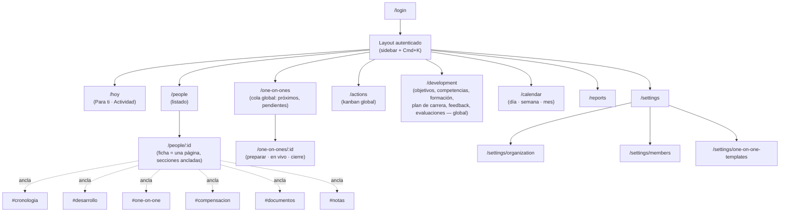

# 6. Navegación

## 6.1 Sitemap

## 6.2 Navegación primaria (sidebar)

Siete accesos fijos, en este orden (frecuencia de uso decreciente en tu día a día real):

1. **Hoy** — el asistente accionable (`04-dashboard.md`).
2. **Personas** — el hub; toda la app "vive dentro" de una persona, este es el punto de entrada.
3. **One2One** — cola global de reuniones (próximas de todo el equipo, pendientes de programar), para planificar la semana sin entrar persona por persona.
4. **Acciones** — kanban global entre todo el equipo.
5. **Desarrollo** — vista global de objetivos/competencias/formación/evaluaciones entre todo el equipo (p. ej. "qué objetivos están at-risk en todo el equipo"), complementaria a la sección "Desarrollo" dentro de cada ficha.
6. **Calendario** — vista temporal de todo lo anterior (§6.3).
7. **Informes** — generación y consulta de informes.

**Ajustes** vive aparte, en la parte inferior del sidebar (icono, no en la lista principal) — se usa con poca frecuencia y no debe competir visualmente con la navegación diaria.

Nota de diseño: One2One y Acciones y Desarrollo **no dejan de existir como vistas globales** aunque la persona sea el centro del producto — son colas de trabajo cruzadas entre personas (“¿qué tengo esta semana?”, “¿qué está bloqueado en todo el equipo?”) que ninguna ficha individual puede responder por sí sola. La persona es el centro del *modelo de datos y de la narrativa*; estas vistas son *lentes agregadas* sobre ese mismo modelo, no un sistema aparte.

## 6.3 Calendario

Vista temporal de todo evento con fecha, en tres densidades (día/semana/mes, selector arriba a la derecha, como Notion/Google Calendar):

| Tipo de evento | Color | Origen |
|---|---|---|
| 1:1 | teal (`--accent`) | `one_on_ones.scheduled_at` |
| Vacaciones / ausencia | gris | *nuevo*: `time_off` |
| Festivo | gris claro, franja de día completo | *nuevo*: `holidays` (por organización/región) |
| Cumpleaños | rosa suave | `people` (campo de fecha de nacimiento, opcional) |
| Revisión salarial programada | ámbar | recordatorio derivado de la regla "&gt;X meses sin revisar" (mismo insight del dashboard, mostrado también aquí) |
| Recordatorio manual | neutro | *nuevo*: recordatorio libre creado por el manager |

- Clic en cualquier evento abre su detalle en un panel lateral (drawer), nunca navega fuera del calendario salvo que el usuario pida explícitamente "ver ficha completa".
- Vista semana es la que se abre por defecto (mejor equilibrio densidad/planificación para un manager).
- Días con festivo o con la persona de vacaciones se atenúan visualmente en la vista de "próximos 1:1" del dashboard, para evitar sugerir programar una reunión en un día no laborable.

## 6.4 Plantillas de One2One (Ajustes)

`/settings/one-on-one-templates` — pantalla de administración, fuera del uso diario:

- Lista de plantillas por departamento (una tarjeta por departamento + "Plantilla por defecto").
- Editor de una plantilla: lista ordenable (drag) de bloques del catálogo cerrado definido en `02-user-experience.md` §2.4, con un selector para añadir un bloque nuevo del catálogo — no existe un "bloque personalizado" de texto libre para no derivar en un formulario builder.
- Al guardar cambios, se crea una nueva versión de la plantilla; los 1:1 ya realizados mantienen la referencia a la versión con la que se hicieron (consistente con "nada se sobrescribe").
- Vista previa en vivo del formulario resultante antes de guardar.

## 6.5 Ajustes — resto

- **Organización**: nombre, departamentos (alta/edición/jerarquía simple).
- **Miembros**: invitar managers, asignar rol (Admin/Manager), ver a qué equipo tiene acceso cada uno — pantalla que no se usa hasta la Fase 4 (multiusuario) pero cuyo espacio en la navegación se reserva desde ahora.

## 6.6 Búsqueda y paleta de comandos

Detallada en `02-user-experience.md` §2.3. Nota de navegación: la paleta de comandos es el atajo real para casi todo lo anterior — el sidebar existe para descubribilidad (usuarios nuevos, managers que se incorporen en la Fase 4) y para las vistas agregadas que no tienen "nombre" que buscar (Hoy, Calendario).
